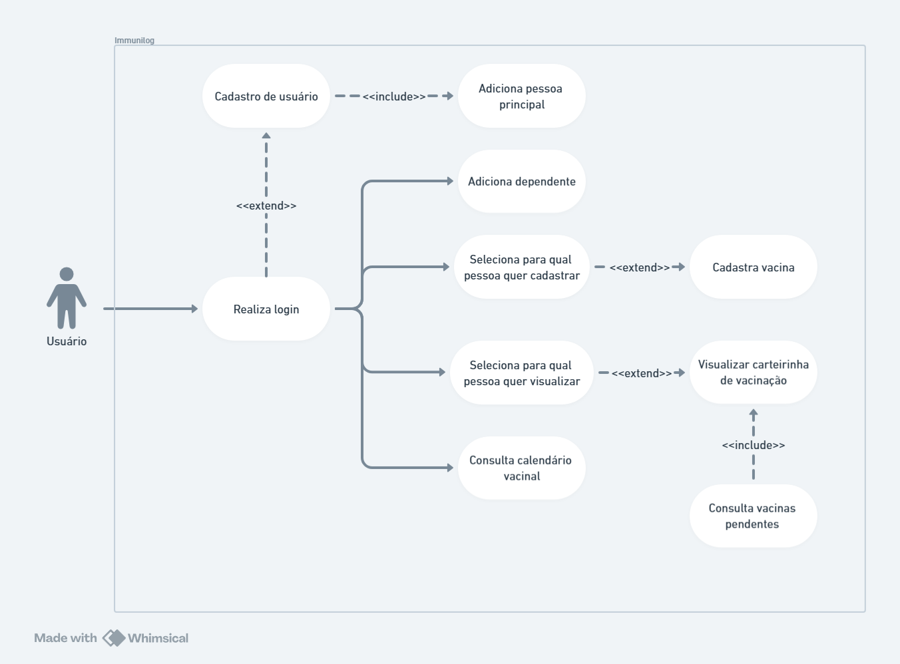

# Casos de uso
## Atores
1. Usuário: Pessoa logada no sistema.
2. Admin sistema: usuário com permissão de admin.

## Casos de uso
1. Cadastro de Usuário
	-  Ator Principal: Usuário
	- Descrição: Permite que um usuário crie uma conta pessoal no sistema.
2. Login do Usuário
	- Ator Principal: Usuário
	- Descrição: Permite que um usuário registrado acesse sua conta no sistema.
3. Cadastrar Vacina
	- Ator Principal: Usuário
	- Descrição: Permite que um usuário registre uma vacina que tenha sido tomada.
4. Registra Vacina
	- Ator Principal: Admin sistema
	- Descrição: Permite que o administrador aceite o registro que foi cadastrado pelo usuário.
5. Adicionar Dependentes
	- Ator Principal: Usuário
	- Descrição: Permite que um usuário adicione dependentes à sua conta.
6. Consultar Calendário Vacinal
	- Ator Principal: Usuário
	- Descrição: Permite que um usuário consulte o calendário vacinal do PNI (SUS) ou da Sociedade Brasileira de Imunizações.
7. Notificar Vacinas
	- Ator Principal: Sistema
	- Descrição: Permite que o sistema envie notificações por e-mail aos usuários sobre vacinas pendentes.

## Diagrama de casos de uso
